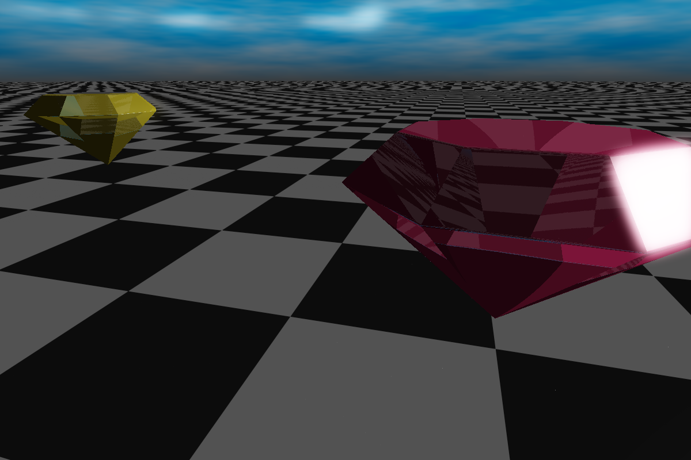

# SDF-Playground

A small graphics engine for demos, small games, and playing around with SDFs in general.

## What are SDFs?

SDF stands for "Signed distance function". It is a mathematical function of space (either R² or R³) which for each point evaluates the scene and gives the closest distance to the scene geometry. If the distance to the scene is 0, this point lies on the surface. As its a "signed" distance function, we define the value to be positive outside an object and negative inside an object. By evaluating this signed distance function, we can find the objects.

This now gives us two tasks:

### Create an SDF for a complex scene

At first glance it does not seem trivial to find a mathematical function to describe a complex 3D scene. However, we can use a systematic approach:
-use basic primitives like boxes and spheres to build up the scene
-use translation, rotation, domain repetition, recursion, or operators to build more complex objects
-combine several objects (union, subtraction, intersection) into a more complex scene

### Find the objects in this scene

given an SDF, we can use several algoritms to turn the field into a scene one of the most popular ones is "sphere tracing"

Here we sample the distance to the scene. We thusly know that we can march forward at least this distance value without hitting anything. After marching forward, we again sample the SDF and get the new distance. We repeat this either until we get very close to an object (value becomes close to zero) or the value gets very large, and we left the scene. This is a very basic algorithm, we can improve upon this one (its basicly a root finding algorithm), but largely how the engine works internally.

In order to apply colors and materials to the scene, we not only find the closest point to the scene, but also record properties for each object, which we can use in the engine.

## Effects

Here we see the several things in action:
- the sphere is glowing, showcasing the bloom effect and the HDR pipeline
- the mirror is reflecting the scene, showing the reflections.
- the object itself is one single SDF, showing how one can create simple 2D SDFs and revolve them into a 3D shape. All parameters adjustable in realtime!

The engine also supports transparent material. Looking through a transparent or semitransparent material will give the correct result. It also supports coloring the shadows of transparent objects.

Here we have flowing gems, which were created by the intersection of 3 planes, and a clever rotation. The gem was replicated using another rotation operation. Also the gems include correct refraction.

This scene shows how one can easily get an infinite sized level by mirroring and repeating simple geometry. The walls are just 2 blocks and some folding operations. Also, the bowls show a fancy merge operation, adding these rounded lines on the intersection point to enrich the geometry. Additionally we have a fire effect going on, which is a fully procedural texture.

Here we have a fully working lense, made from 3 spheres and some boolean operations. It behaves like a lense would, refracting on both surfaces. Additionally we have a glass panel behind it, having reflection as well as refraction, showcasing how the engine can handle both at the same time (if your GPU can handle this)

Each scene can define up to 8 light sources at the same time, which can either be directional or a point light. They also cast correct shadows which can overlap

The yellow cubes have a reflective material applied to them. Also note how we can have an infinite amount of them without much higher cost.

Fractals are done by recursively folding and scaling the scene. As such, they are not that expensive, and way cheaper then with a polygon based engine.
## Materials

Since materials can make use of the R³ position, its very easy to create "volumetric" materials which also fill the inside. A few examples:

This material shows the coordinate lines. It can be adjusted how steep the slope for lines can get, and also if you want it in cartesian or spherical coordinates. Use the box_offset slider to move in and out a cutting object!

It is very tempting to modify the SDF directly, e.g. by adding a sine wave. This will mostly result in the distortion you wanted, but it breaks the promise of the SDF, that for each distance it reports, you can march this distance without encountering an object. This will lead to artifacts. One can combat this effect by reducing the step size artificially, at the cost of performance. It is possible however to add this distortion in a clever way without breaking the SDF or causing too much of a performance loss. This can be used to implement an arbitraty mathematical height offset. In this example image it is used to create a brick wall. Since it actually deforms the geometry, the surface will also be accuratly represented in e.g. shadows.

The materials applied can have arbitrary complexity. Here we see 3 examples, from left to right:

-a voronoi glass window. Here the pane is tiled but each "cell" is irregular, giving it an unique look. For now the color is random, but you can assign each cell an unique color for nice effects. Position within the cell is also provided, here to create the darker border between the cells

-a truchet tiling. Here we chain the following methods together:
* First we split the area into tiles, each with an unique ID. We retain full control over the tile size or position
* For each cell, we define the basic pattern, here the 2 arcs. We also determine if they should be flipped or not (a slider is used to set the probability)
* For each position on the arc, we calculate local UV texture coordinates. These can also be animated
* We apply a texture to it based on these UV coordinates. It can be any texture. Here we use a simple stripe texture, resulting in this look

-a metal braided structure. We use a similar trick as above with tiling the area into smaller tiles. Here we shrink each tile a bit to see the (virtual) tile beneath it, and we also rotate it as to get this over-under-over-under braided look. Additionally we rotate and stretch it a bit so give this final look. The user has full control over the repetitions and the stretching. Behind the pane is the same material applied to a cylinder

## Other Scenes

This is the basic scene you see when starting the engine. It showcases some simple light and shadows, as well as a floor material. You can use this as starting point. Also noteworthy is that the sphere and the floor uses an analytic function to accelerate the ray intersection. Instead of marching 10-30 steps along they both find their intersection with only one step and are thus very fast to render.

Another fractal done by recursive strategy. Works correctly with lights and shadows.

Here we have a "shell" operator which creates an extra surrounding layer like a casting form. In this scene it is applied twice. Can be used to generate complex geometry quickly.

Here we have a rather complex SDF primitive. The entire spiral is described by one SDF. It can be fully adjusted regarding the height, number of revolutions, starting angles, etc...

Here we have 2 interesting features:
- a vase described by 3 spheres and a cut plane. The rest is combinating and smoothing them.
- a table with a wooden texture. The texture is fully procedural and is offset every so often to give the impression of individual pieces of wood glued together.

This shape also known as a gyroid is a very complex shape resulting from trigonometric operations. It would be very hard to render with a polygon engine, but for an SDF engine this is no problem. It would be infinite in size, so it was cut to allow a better view.

When you want to test out some values in the shader, changing the value and recompiling it each time is too time consuming. Thus we introduced the variable manager. With a simple syntax:
`VAR_name(min=0, max=10, step=0.5, start=2)`
you can define a new variable with the name `name`, as well as give it minimum, maximum, default and step parameters. Each parameter is optional. When you compile a shader with this variable, it will appear in the variable manager list with a slider. Moving the slider updates the value in the shader in realtime. This makes testing values very quick.

## Getting started

If you want to play around, check out the different scenes and try to modify one a bit to see the effects. In order to create your own scene, use the `map` function to:
-define your geometry. Create your own or check the `sdf_primitives.hlsl` for existing ones. Add the object with the `OBJECT` makro to the scene
-give it a material. Use the `MATERIAL` makro for this. For the beginning, just set the `material_output.diffuse_color.rgb` field
-use the `map_light` function to define up to 8 simultaneous light sources, which can be point lights or directional lights
-use the `map_background` function to define a scene background
-if you want to skip the gradient evaluation, you can use the `map_normal` function to supply your own normal vectors. Can be left empty
